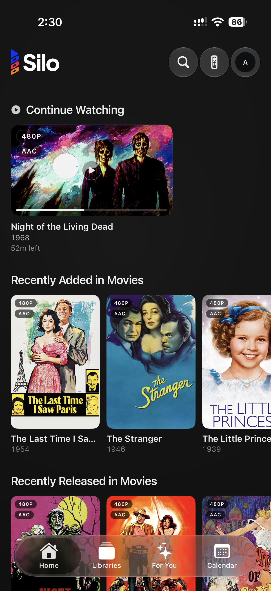
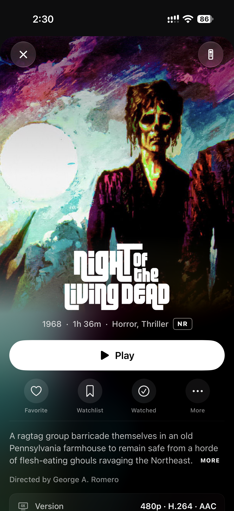
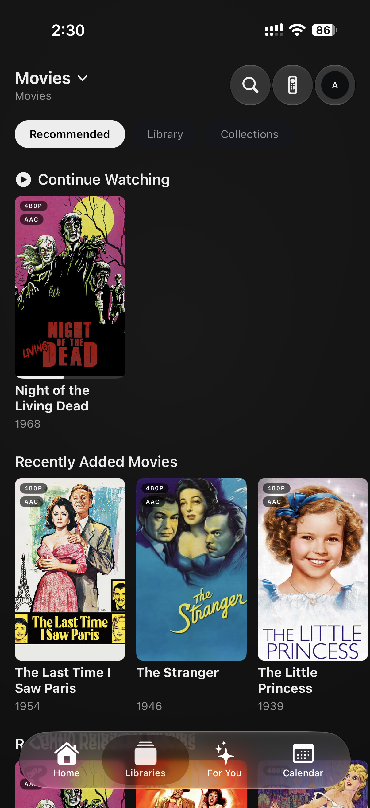

# Silo Apple

Native Apple clients for the [Silo](https://github.com/Silo-Server/silo-server) self-hosted media server.

This repo builds iOS, tvOS, and the early macOS target. It preserves the existing Apple bundle IDs, keychain groups, and signing IDs for TestFlight and install continuity, but user-facing names, docs, and server references now use Silo.

## TestFlight

Try the latest beta builds of the iOS and tvOS apps:

**[Join the Silo TestFlight beta](https://testflight.apple.com/join/XZy8cu5q)**

## Screenshots

### iOS

<p>
  
  
  
</p>

### tvOS

<p>
  
</p>

## Layout

- `iosApp/iosApp/` - shared SwiftUI app code for iOS, tvOS, and macOS
- `iosApp/TopShelf/` - tvOS Top Shelf extension
- `iosApp/Tests/` - XCTest targets
- `iosApp/Resources/` - shared Apple resources
- `iosApp/Signing/` - checked-in signing defaults plus local override sample
- `iosApp/project.yml` - XcodeGen project source of truth
- `fastlane/` - iOS/tvOS release automation
- `docs/tvos-player/` - Apple TV playback notes

## Prerequisites

- Xcode 26+
- `xcodegen`
- Ruby 3.2 with Bundler for release automation
- A running Silo server for local auth, browsing, and playback validation

## Build

Generate the Xcode project from the checked-in XcodeGen spec:

```sh
cd iosApp
xcodegen generate
open Silo.xcodeproj
```

Build without local signing:

```sh
cd iosApp
xcodebuild build \
  -project Silo.xcodeproj \
  -scheme Silo \
  -destination 'platform=iOS Simulator,name=iPhone 17 Pro' \
  CODE_SIGN_IDENTITY='' CODE_SIGNING_ALLOWED=NO

xcodebuild build \
  -project Silo.xcodeproj \
  -scheme SiloTV \
  -destination 'platform=tvOS Simulator,name=Apple TV 4K (3rd generation)' \
  CODE_SIGN_IDENTITY='' CODE_SIGNING_ALLOWED=NO

xcodebuild build \
  -project Silo.xcodeproj \
  -scheme SiloMac \
  -destination 'platform=macOS' \
  CODE_SIGN_IDENTITY='' CODE_SIGNING_ALLOWED=NO
```

## VS Code

The checked-in `.vscode` configuration provides recommended extensions,
unsigned build and test tasks, and SweetPad integration for building, running,
debugging, simulator management, and Swift code intelligence without using the
Xcode UI.

1. Install Xcode and select its command-line toolchain:

   ```sh
   sudo xcode-select --switch /Applications/Xcode.app/Contents/Developer
   sudo xcodebuild -runFirstLaunch
   ```

2. Install XcodeGen:

   ```sh
   brew install xcodegen
   ```

3. Open the repository root in VS Code and accept its extension
   recommendations.
4. Run `Tasks: Run Task` → `Silo: Generate Xcode project`.
5. In the SweetPad sidebar, select a scheme and an installed destination.
6. Run `SweetPad: Set up Swift code intelligence (BSP)` once from the command
   palette, then open a Swift file. The generated `buildServer.json` is
   machine-specific and intentionally ignored.

Use `Cmd+Shift+B` for the default unsigned iOS build. Use the Testing sidebar
or `Tasks: Run Test Task` for XCTest. The test task prompts for a simulator
destination so each developer can use an installed device without committing
machine-specific configuration.

SweetPad uses Xcode's compiler, SDKs, signing tools, and simulators under the
hood, so the full Xcode application remains required even when its UI is not
part of the daily workflow.

## Signing

Local signing overrides are intentionally ignored.

1. Copy `iosApp/Signing/Local.xcconfig.sample` to `iosApp/Signing/Local.xcconfig`.
2. Override bundle identifiers, entitlements, or development team values as needed.
3. Run `xcodegen generate` from `iosApp/`.

Personal Apple Developer teams cannot join the production App Group, so Top Shelf rows stay empty under that setup.

## Release Flow

Fastlane lanes are defined in `fastlane/Fastfile`. All Apple IDs, team IDs, signing repo URLs, and App Store Connect credentials must come from CI environment variables.

## Contributing

Read [CONTRIBUTING.md](CONTRIBUTING.md) before opening a pull request. Features,
navigation or behavior changes, large refactors, and shared contract changes
should start as an issue.

## License & Trademarks

Silo Apple is licensed under `AGPL-3.0-or-later` with an additional
permission under AGPL section 7 allowing distribution through the Apple App
Store and TestFlight despite those platforms' signing, DRM, and
redistribution terms. See [LICENSE](LICENSE) and
[APPSTORE-EXCEPTION.md](APPSTORE-EXCEPTION.md).

The **Silo name, logo, and wordmark are trademarks of Silo Media L.L.C.** and
are **not** covered by the AGPL. You're free to fork and redistribute the code,
but forks and redistributions must not use the Silo brand as their identity and
must remove or replace the brand assets. Publishing a Silo-branded app to an app
store requires written permission. See [TRADEMARK.md](TRADEMARK.md) for what's
permitted — including referential use like "compatible with Silo."

FFmpeg, Nuke, fastlane, and other third-party dependencies retain their own licenses. See [THIRD_PARTY_NOTICES.md](THIRD_PARTY_NOTICES.md).
